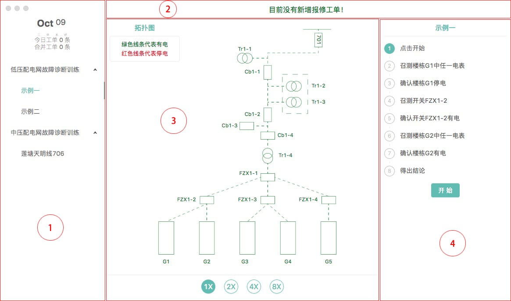

# 配电网多源信息故障诊断模拟软件

## 安装

[**这里**](https://github.com/Loongwoo/NanFang/releases/latest) 去下载最新版本。

## 开发

```
$ git clone https://github.com/Loongwoo/NanFang.git
$ cd NanFang
$ yarn install
$ yarn run start:main
$ yarn run start:renderer
```

## 界面介绍



1. [菜单栏](#菜单栏)
2. [通知栏](#通知栏)
3. [拓扑图](#拓扑图)
4. [流程栏](#流程栏)

### 菜单栏

- 菜单栏的上部分显示当天日期和今日工单、合并工单，随着演示的进行今日工单和合并工单会随之变化；

- 菜单栏的下部分有两级菜单，第一级菜单分为低压配电网故障诊断训练和中压配电网故障诊断训练；

- 低压部分有两个示例，中压部分有一个示例，选择某一个示例，右边部分会显示相应的配置。

### 通知栏

- 可以通过鼠标拖拽通知栏调整整个窗口的位置；

- 可以通过鼠标双击通知栏最大化和还原整个窗口；

- 在演示开始时，用绿色字体显示“目前没有新增报修工单”；

- 演示开始后，如果有报修工单，将会用红色字体滚动显示工单号；

### 拓扑图

- 绿色线条代表电路畅通，红色代表电路不通；

- 可以点击下方 1X、2X、4X、8X 四个按钮分别将拓扑图放大 1 倍、2 倍、4 倍和 8 倍；

- 可以通过双击拓扑图依次放大 1 倍、2 倍、4 倍和 8 倍；

- 拓扑图放大之后，可以通过鼠标的拖拽查看拓扑图的不同部位；

### 流程栏

- 顶端显示该示例的名字

- 通过【开始】和【下一步】等按键控制流程往下走

- 完成的步奏前面步奏号会变成【√】，当前步奏深颜色显示

## 协议

MIT © [Loongwoo](https://github.com/Loongwoo)
